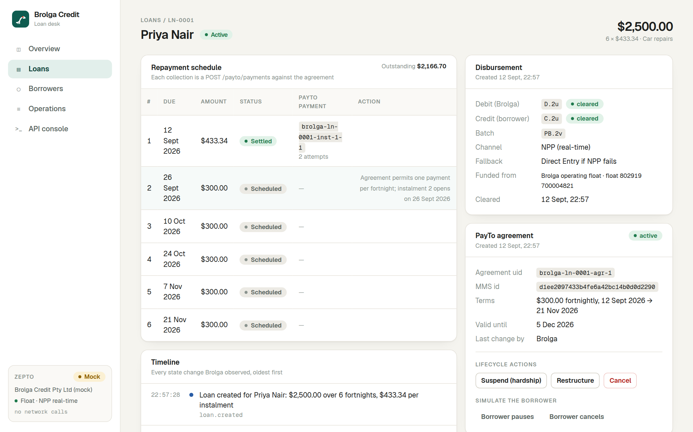

# Brolga Credit — a consumer-lending demo on Zepto

> **Status:** built and verified end to end against the Zepto sandbox on 12 September 2026
> (Direct Entry disbursement, PayTo agreement, real-time collection with failure and retry,
> suspension, reactivation, bilateral amendment, cancellation), then independently reviewed
> and hardened on 13 September (see [Tests](#tests)). A demo, not a product.



Brolga Credit is a fictional small-loan lender. This app is its loan desk: a loan
officer verifies a borrower's bank account, disburses the loan, sets up a PayTo
repayment agreement, collects instalments, and handles the things that happen to
loans afterwards — missed payments, hardship pauses, restructures, payoff.

Every one of those steps is a real call to the Zepto API. Nothing is faked when
the app is pointed at the Zepto sandbox; the `mock` mode exists only so the app
can be developed and demonstrated when the sandbox is unreachable.

## Run it

Requirements: Node 20+ (tested on 24).

```bash
npm install
copy .env.example .env.local     # then paste your sandbox token into ZEPTO_TOKEN
npm run build
npm start                        # http://localhost:3000
```

`npm run dev` also works and hot-reloads, but `build` + `start` is the mode to
use in front of an audience: no compile-on-first-visit pauses.

Set `ZEPTO_MODE=mock` in `.env.local` to run without any network access. The
mock reproduces the sandbox's state machines (payout clearing, PayTo
authorisation delays, amount-driven failures, agreement rules) closely enough
to rehearse the whole demo offline. Each mode keeps its own store
(`data/brolga.json` for the sandbox, `data/brolga.mock.json` for the mock), so
switching modes shows a different set of loans rather than pretending the
sandbox references can be resumed offline.

## The story the demo tells

1. **Verify** — `POST /cop/account/validate` (Confirmation of Payee) checks the
   name on the borrower's account before any money moves.
2. **Disburse** — `POST /payments` sends the principal. From a Zepto Float
   Account it goes over the NPP in seconds with Direct Entry as fallback; from
   a linked bank account it goes by Direct Entry.
3. **Mandate** — `POST /payto/agreements` creates a fixed fortnightly PayTo
   agreement the borrower authorises in their own banking app.
4. **Collect** — each instalment is a `POST /payto/payments` that settles or
   fails in real time with an ISO reason code; failed ones can be retried.
5. **Handle life** — suspension and reactivation for hardship, bilateral
   amendment to restructure the instalment, cancellation on payoff, and
   simulated borrower-initiated actions from the banking-app side.
6. **Reconcile** — the Operations screen reads Zepto's own ledger
   (`GET /transactions`, `GET /payto/payments`) rather than the app's beliefs;
   the API console shows every request with version header, idempotency key,
   request id and latency.

## How it is built

```
src/lib/zepto/      typed client for the subset of Zepto used, plus a mock with the same interface
src/lib/domain/     the lending logic: quotes, schedules, state transitions, polling
src/lib/db.ts       a JSON-file store, one file per mode — one operator, one process, no database
src/app/api/        route handlers the UI calls; the token never reaches the browser
src/app/            the screens (Next.js App Router, client components, Tailwind)
tests/review/       offline invariant suite that drives the domain layer against the mock
scripts/            Playwright walkthrough that screenshots the whole demo
```

Design choices worth knowing:

- **Money moves only when the ledger says so.** A loan is disbursed when the
  borrower-side credit clears, not when the debit leaves. Nothing is collected
  until then, and nothing is collected on a loan whose disbursement failed.
- **Every outbound money call is written down before it is sent.** The
  disbursement intent (with its idempotency key) and the instalment (with its
  PayTo uid) are persisted first. If the network or a 5xx swallows the answer
  the record is marked `unknown`; the next refresh asks Zepto what happened
  (`GET` by uid, or replay the `POST` and read the 409's `resource_ref`)
  before anything is retried, so a lost response never becomes a second
  payment.
- **A restructure changes the authority, Brolga reconciles the debt.** The
  PayTo amendment changes what may be collected; the remaining balance is
  re-cut locally (settled and in-flight instalments keep their amounts) and
  any rounding is recorded as an adjustment so the schedule always equals the
  obligation.
- **Confirmation of Payee is a gate.** A no-match or closed account puts the
  loan on hold; disbursing needs an audited override with a reason.

- **Polling, not webhooks.** Webhook endpoints can only be created in Zepto's
  portal and need a public URL. Brolga polls the specific objects it has in
  flight (`GET /payments/{ref}`, `GET /payto/agreements/{uid}`,
  `GET /payto/payments/{uid}`) and applies the same state transitions a webhook
  consumer would. Swapping in webhooks is a transport change, not a logic change.
- **Zepto is the system of record for money.** Brolga stores references
  (`PB.*`, `D.*`, agreement and payment uids) and derives loan status from
  what Zepto reports.
- **Sandbox behaviours are first-class.** Simulation controls (how the borrower
  responds to the mandate, whether a collection settles) are in the UI so the
  failure paths can be shown, not just described.

## Tests

```bash
node --disable-warning=ExperimentalWarning tests/review/review-tests.mjs . tests/review/results.json
```

Forty-five checks run the real domain code and route handlers against the mock
provider with a controllable clock and no network: schedule arithmetic, the
credit-is-the-truth disbursement rule, collection gating, lost-response
recovery for both payouts and PayTo payments, restructure reconciliation,
CoP holds and overrides, daily-limit and one-per-period rules, store
resilience, and redaction in the API log. The suite began as an independent
review harness (14 of 36 checks passed on the first cut) and was kept as the
regression gate while the findings were fixed.

`CHROME_PATH=<chromium> node scripts/walkthrough.mjs http://localhost:3000 ./shots`
drives the whole demo in a browser and saves a screenshot of each step.

## Things learned about the Zepto API while building this

- `Zepto-Api-Version: 20260101` is mandatory for this account; without it every
  call is a 409 "API Version Below Minimum". The versioning page says the header
  is optional.
- A missing OAuth scope is a 403 with an empty body. The only explanation is in
  the `WWW-Authenticate` header (`error="insufficient_scope"`), which the client
  parses and surfaces as a readable message.
- Personal access tokens freeze the application's scopes at creation; adding a
  scope means minting a new token.
- PayTo agreements need `creditor.ultimate_party_name`, and a payment against a
  fixed-terms agreement must land on `first_payment_date` for the first
  collection — hence the schedule starts today.
- The shared sandbox resolves common test account numbers to other tenants'
  accounts; unusual numbers keep contacts clean.
- Two API generations coexist: legacy payouts (`PB.1`, page numbers, string
  errors) and PayTo/CoP (UUIDs, cursors, coded errors). The client normalises
  both error shapes.
- A failed Direct Entry payout does not fail on the payout: the debit from your
  account clears, the borrower-side credit comes back `returned` with the reason
  code, and a `payout_reversal` credit follows. The credit is only visible on
  `GET /transactions` with `both_parties=true`, so that is what the app watches.
- Sandbox failure triggers are exact amounts (`$1.05` → E105), not "ending in
  .05"; `$250.05` clears normally.
- The sandbox enforces a `$1,000` daily PayTo collection limit (`ZPPAY01`) and
  one payment per agreement period; a payment left under investigation counts
  against the period.
- The portal's "available scopes" list and the documentation's list disagree.
  The portal offers `counterparties`, `float_accounts` and `payments_payouts`,
  which the docs never mention, and does not offer `cop_account_validations`
  at all for this account.
- Confirmation of Payee, alias resolution (PayID lookup) and Investigations
  appear to need account-level enablement beyond the documented scope list:
  CoP answers `403 "not permitted"` for this account and the portal does not
  offer its scope. A 403 alone does not prove why, so the app reports the
  check as unavailable rather than diagnosing it.
- An idempotent replay of `POST /payments` returns 409 with
  `meta.resource_ref` naming the batch the first request created — which is
  what makes lost-response recovery possible without a second payout.
